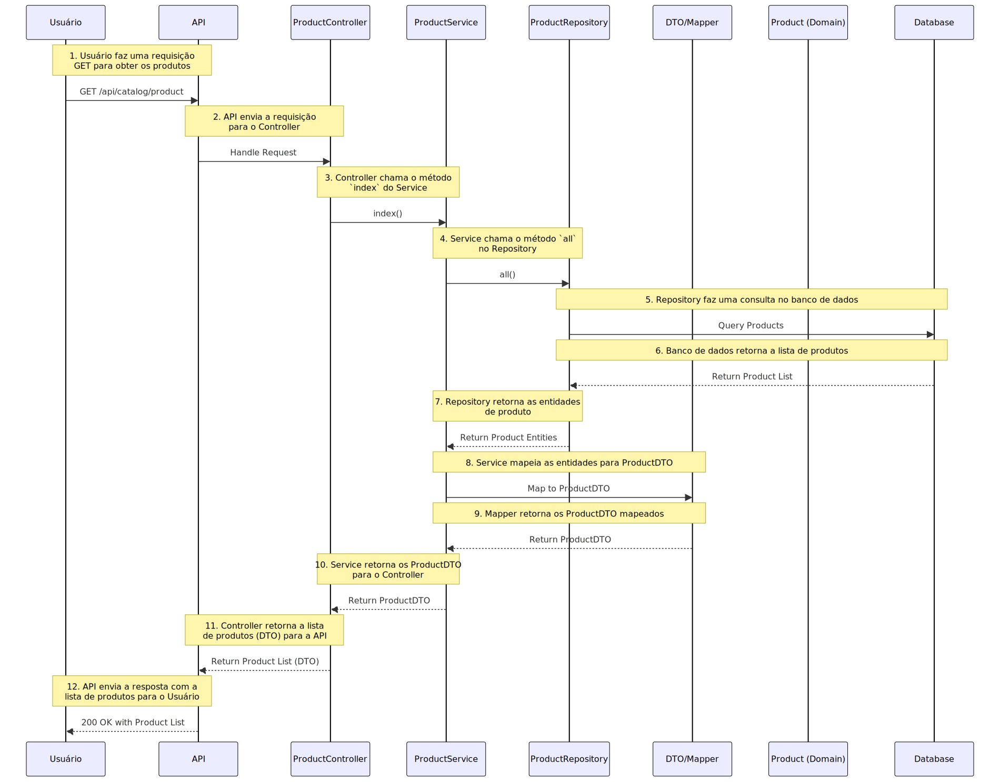

# **Product Microservice**

Este repositório contém o microserviço **Product**, parte do sistema **Self-Service Kiosks**. Ele gerencia as operações relacionadas aos produtos, incluindo cadastro, edição, consulta e exclusão, além de suportar o armazenamento de imagens no AWS S3.

---

## **Índice**
1. [Descrição](#descrição)
2. [Principais Tecnologias](#principais-tecnologias)
3. [Arquitetura](#arquitetura)
4. [Pré-requisitos](#pré-requisitos)
5. [Configuração e Execução](#configuração-e-execução)
6. [Estrutura de Pastas](#estrutura-de-pastas)
7. [Principais Endpoints](#principais-endpoints)
8. [Licença](#licença)

---

## **Descrição**
O **Product Microservice** é responsável pelo gerenciamento de produtos dentro do sistema **Self-Service Kiosks**. Ele segue o padrão de **Clean Architecture** para garantir uma separação clara entre as camadas de Domain, Application, Infrastructure e Presentation.

---

## **Principais Tecnologias**
- **Slim Framework 4**: Framework PHP para criação de APIs leves e rápidas.
- **Clean Architecture**: Design orientado a manutenibilidade e escalabilidade.
- **Docker**: Contêinerização para garantir portabilidade.
- **AWS S3**: Armazenamento de imagens de produtos.
- **Terraform**: Gerenciamento de infraestrutura como código (IaC).
- **Nginx**: Servidor web para proxy reverso.
- **Node.js**: Gerenciamento de hooks e tarefas assíncronas.
- **MySQL 8**: Banco de dados relacional de alta performance, utilizado para armazenar as informações de produtos, com suporte a consultas otimizadas e novos recursos como window functions e JSON.

---

## **Arquitetura**
O microserviço segue os princípios da **Clean Architecture**, dividindo-se em:
1. **Domain**: Regras de negócio.
2. **Application**: Casos de uso.
3. **Infrastructure**: Integração com banco de dados, S3 e outros serviços externos.
4. **Presentation**: Controladores e rotas da API.

---

## **Pré-requisitos**
Antes de iniciar, verifique se você possui as seguintes ferramentas instaladas:
- [Docker](https://www.docker.com/)
- [Docker Compose](https://docs.docker.com/compose/)
- [Terraform](https://www.terraform.io/)
- [Node.js](https://nodejs.org/)

---

## **Configuração e Execução**
### **1. Clone o repositório:**
```bash
git clone https://github.com/seu-usuario/ssk-products-backend.git
cd ssk-products-backend
```

### **2. Configure as variáveis de ambiente:**
Crie um arquivo `.env` com base no `.env.example` e configure:
- Credenciais do AWS S3.
- Configurações do banco de dados.
- Porta de execução.

Para organizar e documentar os passos de criação e execução das imagens Docker no seu projeto, você pode criar as imagens `Dockerfile.app` e `Dockerfile.nginx` na pasta `infra/docker` e, em seguida, executar o `docker-compose up -d` a partir da pasta raiz. No seu `README.md`, você pode adicionar um guia passo a passo para isso.

Aqui está uma sugestão de como documentar o processo no `README.md`:

---

## **Configuração e Execução com Docker**

Este projeto utiliza o **Docker** para facilitar a execução dos serviços, como a aplicação e o servidor **Nginx**. Siga as etapas abaixo para construir e rodar os containers.

### Estrutura de Diretórios

Dentro da pasta `infra/docker`, você terá dois arquivos **Dockerfile**:
- `Dockerfile.app`: Para a aplicação.
- `Dockerfile.nginx`: Para o servidor Nginx.

### Passo 1: Criar as Imagens Docker

Primeiro, crie as imagens Docker utilizando os arquivos `Dockerfile.app` e `Dockerfile.nginx`.

1. Navegue até a pasta `infra/docker`:

    ```bash
    cd infra/docker
    ```

2. **Construir a imagem da aplicação** (`Dockerfile.app`):

    ```bash
    docker build -t self-service-kiosks-app -f Dockerfile.app .
    ```

3. **Construir a imagem do Nginx** (`Dockerfile.nginx`):

    ```bash
    docker build -t self-service-kiosks-nginx -f Dockerfile.nginx .
    ```

### Passo 2: Subir os Containers com Docker Compose

Depois de construir as imagens, volte para a raiz do projeto e execute o `docker-compose` para iniciar os containers.

1. **Volte para a pasta raiz** do projeto:

    ```bash
    cd ../../
    ```

2. **Execute os containers** em segundo plano (modo `detached`):

    ```bash
    docker-compose up -d
    ```

Isso irá iniciar todos os serviços configurados no seu arquivo `docker-compose.yml`, incluindo a aplicação e o servidor **Nginx**.

### Passo 3: Acessar os Serviços

Após os containers estarem em execução, você pode acessar os serviços da seguinte maneira:

- **Aplicação**: Acesse a aplicação em `http://localhost:5000` (ou na porta configurada no seu `docker-compose.yml`).
- **Servidor Nginx**: O Nginx estará disponível na URL configurada, por exemplo, `http://localhost:80`.

---

### **4. Aplique a infraestrutura com Terraform:**

1. Navegue até a pasta `infra/terraform`:

    ```bash
    cd infra/terraform
    terraform init
    terraform fmt
    terraform validate
    terraform plan -out=plan.out
    terraform apply "plan.out"
    ```

### **5. Acesse o microserviço:**
A API estará disponível em: `http://localhost:5000`

---

## **Estrutura de Pastas**
```plaintext
app/
├── Domain/          # Entidades e interfaces de domínio.
├── Application/     # Casos de uso e serviços de aplicação.
├── Infrastructure/  # Repositórios, S3 e banco de dados.
├── Presentation/    # Rotas e controladores da API.
├── IoC/             # Responsável por centralizar as configurações de Inversão de Controle (IoC)
docker-compose.yml   # Configuração dos contêineres.
terraform/           # Configuração de infraestrutura com Terraform.
.env.example         # Arquivo de exemplo para configuração de variáveis.
```

---

## **Principais Endpoints**
### **Products**
| Método | Endpoint                | Descrição                        |
|--------|-------------------------|----------------------------------|
| GET    | `/api/products/search`  | Lista todos os produtos.         |
| POST   | `/api/products`         | Cria um novo produto.            |
| GET    | `/api/products/{id}`    | Obtém detalhes de um produto.    |
| PUT    | `/api/products/{id}`    | Atualiza um produto existente.   |
| DELETE | `/api/products/{id}`    | Remove um produto.               |

### **Files**
| Método | Endpoint                           | Descrição                        |
|--------|------------------------------------|----------------------------------|
| POST   | `/api/products/{id}/files`         | Faz upload de uma imagem.        |
| GET    | `/api/products/{id}/files`         | Lista imagens do produto.        |
| DELETE | `/api/products/images/{id}/files`  | Remove uma imagem específica.    |

Para adicionar o link da **API** para gerenciar produtos no seu README, você pode simplesmente incluir uma seção explicando como acessar a documentação da API (gerada pelo Swagger ou outra ferramenta de documentação OpenAPI). Aqui está um exemplo de como fazer isso:

---

## **Documentação da API**

A API para gerenciar os produtos pode ser acessada localmente através da seguinte URL:

- **Documentação da API**: [http://localhost:5000/docs/openapi.json](http://localhost:5000/docs/openapi.json)

Essa URL fornece o arquivo **OpenAPI** da documentação da API, permitindo que você visualize e interaja com os endpoints da API para gerenciamento de produtos.

### **Como acessar a documentação interativa (Swagger UI)**

Se você estiver utilizando o **Swagger UI** para exibir a documentação interativa da API, ela pode ser acessada no seguinte endereço:

- **Swagger UI**: [http://localhost:5000/docs](http://localhost:5000/docs)

---

## Fluxo de Requisição: Obter Produtos



## **Testes da API**

A URL abaixo pode ser usada para acessar os testes da API:

- **Testes de Funcionalidade**: [http://localhost:5000/tests/Feature/Reports/](http://localhost:5000/tests/Feature/Reports/)

Essa URL fornecerá acesso aos testes específicos da funcionalidade, permitindo verificar os relatórios de forma detalhada. Os testes são realizados através de endpoints de teste configurados no servidor local.

### Como rodar os testes localmente

1. **Inicie a aplicação**:
   Execute sua aplicação no ambiente local:
   ```bash
   docker exec -it app bash
   npm run test


## **Licença**
Este projeto está licenciado sob a [MIT License](LICENSE).

---
